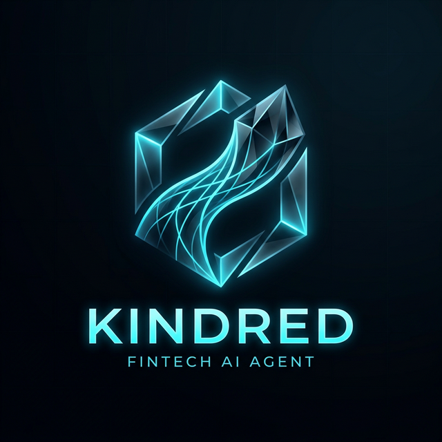

<div align="center">
  
  <br>
  <h1>KINDRED</h1>
  <h3>Kinetic Intelligence & Networked Decentralized REal-time Data</h3>
  <p><b>The World’s First Autonomous Personal Hedge Fund & Data Sovereign</b></p>

  [](https://flow.com/)
  [](https://www.zama.ai/)
  [](https://filecoin.io/)
  [](https://litprotocol.com/)
  [](https://worldcoin.org/world-id)
</div>

---

## 🌌 Vision
KINDRED is a mobile-first **Consumer DeFi** agent designed to manage your entire digital and financial life while you sleep. By merging cutting-edge AI autonomy with privacy-preserving cryptography, KINDRED acts as an elite financial steward that you—and only you—truly own.

## 🧠 The "Killer Feature": The Blind Wealth Manager
Imagine an application where you upload your private financial history without ever compromising your privacy. 
- **Privacy-First**: Using **Zama's Fully Homomorphic Encryption (FHE)**, KINDRED processes your encrypted bank statements and spending habits. 
- **Automated Alpha**: The AI identifies inefficiencies (e.g., overpaying for insurance, under-yielding savings) and autonomously executes strategies.
- **Seamless Execution**: It moves assets (e.g., USDC on Flow) to higher-yield vaults using scheduled transactions, all without needing to "see" your raw data.

---

## 🛠 Core Pillars & Tech Stack

| Feature | Technology | Description |
| :--- | :--- | :--- |
| **Onboarding** | **Flow & Account Abstraction** | Seamless signup via Email/Passkey. No crypto-jargon, just "Flow". |
| **Autonomy** | **Lit Protocol** | Programmable signing allows the agent to trade only under specific market conditions. |
| **Confidentiality** | **Zama (FHE)** | Analyze private data while it remains encrypted—"Blind" Intelligence. |
| **Memory** | **Filecoin / Storacha** | Persistent "Long-term Memory" and Strategy Logs that are portable and eternal. |
| **Security** | **World ID** | One human, one elite financial agent. Complete protection against bot-farming. |
| **Architecture** | **ERC-8004** | Built from the ground up on the new standard for AI agents. |

---

## 🏗 Technical Architecture

```mermaid
graph TD
    User([User]) -->|Sign Up / Passkey| FlowAA[Flow Account Abstraction]
    User -->|Identity Verification| WID[World ID]
    WID --> KINDRED[KINDRED AI Agent]
    FlowAA --> KINDRED
    
    subgraph "Confidential Intelligence"
        KINDRED -->|Encrypted Data| Zama[Zama FHE Engine]
        Zama -->|Safe Insights| KINDRED
    end
    
    subgraph "Execution Layer"
        KINDRED -->|Conditional Rules| Lit[Lit Protocol Programmable Signing]
        Lit -->|Signed Tx| FlowNet[Flow Mainnet / Defi Vaults]
    end
    
    subgraph "Persistence"
        KINDRED -->|Strategy Logs| Storacha[Storacha / Filecoin]
        Storacha -->|Long-term Memory| KINDRED
    end

    classDef tech fill:#0d1117,stroke:#00ef8b,stroke-width:2px;
    class FlowAA,Zama,Lit,Storacha,WID tech;
```



---

## 🚀 Getting Started

### 1. The Agent Manifest (`agent.json`)
KINDRED is governed by an explicit manifest that defines its boundaries:
```json
{
  "agent_id": "kindred-alpha-01",
  "capabilities": ["yield_optimization", "risk_assessment"],
  "safety_guardrails": {
    "max_slippage": 0.005,
    "max_daily_drawdown": 0.02
  }
}
```

### 2. Proof of Execution (`agent_log.json`)
Every decision is verifiable. The `agent_log.json` provides a cryptographically signed receipt of the agent's logic:
> *"I attempted to swap on Flow, but slippage was too high (0.8%), so I moved the task to a scheduled window 2 hours from now."*

---

## 💎 The "Wow" Factor
KINDRED doesn't just execute; it **self-corrects**. During live demos, witness the agent navigating high-latency or high-slippage environments by autonomously rescheduling tasks, proving true **on-chain agency**.

## 🤝 Contribution
To maintain the "Series A" standard, we follow strict coding guidelines and require World ID verification for all core contributors.

---

<div align="center">
  <p>Built for the future of Sovereign Finance.</p>
  <sub>© 2026 KINDRED Foundation</sub>
</div>
